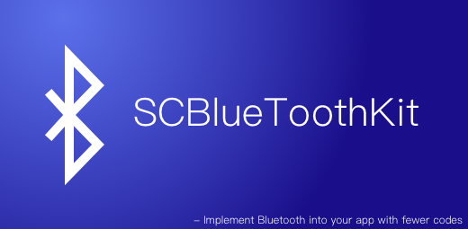

# SCBlueToothKit

This is a Bluetooth Kit based on Core Bluetooth brings you to fly dealing with Bluetooth development.

## Intro

Bluetooth 4.0 brings this amazing creature into our life. You can now easily implement it into your apps through **SCBluetoothKit**. In Bluetooth, two devices that connect with each other are called **Central** and **Peripheral** , so if A device connect with B device through Bluetooth, then one must be **Central** and the other must be **Peripheral**.

## Demo

## Usage

## Contact

